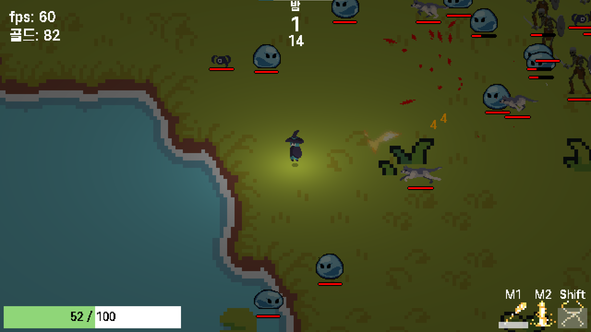
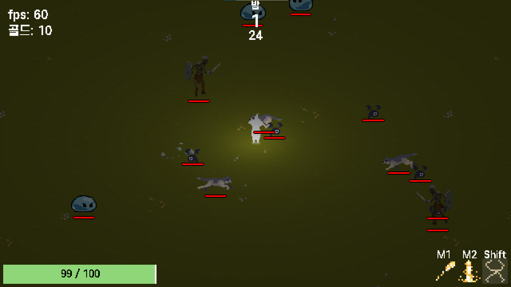
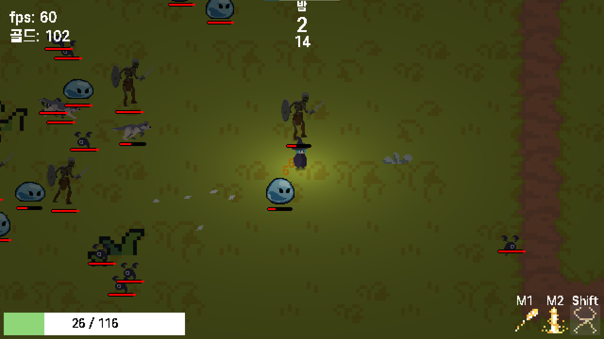

# Install

## prerequisite

### OS

Windows 64비트 운영 체제, x64 기반 프로세서

Ubuntu 22.04.2 LTS (GNU/Linux 5.15.90.1-microsoft-standard-WSL2 x86_64)

see install more detail: <https://learn.microsoft.com/en-us/windows/wsl/install>

### Install pip, python

```
apt update && upgrade
apt install python3 python3-pip
```

## Download this repository

In WSL Ubuntu, clone this repository and enter the project directory

## Install library

```
python -m venv .venv
. .venv/bin/activate
pip install -r requirements.txt
```


# Execute

```
python main.py
```

# Enjoy!

Move: W, A, S, D

Attack: Left Mouse Click

Skill : Right Mouse Click / Shift Key





